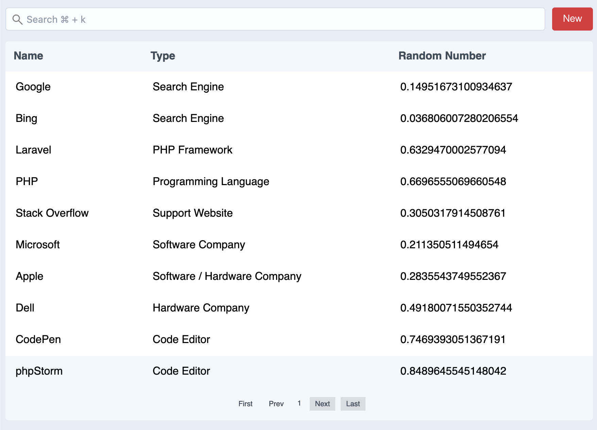

# @nathanbate/vue-list

When I write custom web apps, I need to use lists all the time. So, I 
decided to write a reusable vue component.


*Vue-List with demo data*

## Installation 

```shell
npm i @nathanbate/vue-list
```

## Config Options

See the [demo config](/src/demo/config.js) and the [demo data](/src/demo/data.js)

### showList

`true`: the table of results with always show

`false`: the table of results will only show once 4 characters have been typed
into the search field.

### showHeading

`true`: shows the table column headings

### itemsPerPage

How many items are on each page of the results

### rowLinkable

Does the row link to something? If so, it will look for the `link` property on the row object.

### searchBar

`false`: hides the search bar

### inertiaLinks

`true`: uses [IntertiaJS](https://inertiajs.com) links in Inertia Apps so the page doesn't
reload. Non-Inertia apps will not want to use this.

### rowLinkTarget

Any [valid anchor tag targets](https://www.w3schools.com/tags/att_a_target.asp) can
be used here. If you don't want to use a target, just remove the key from the config.

### actionButton

If you don't want an action button, just omit this from the config.

```
actionButton: {
        label: 'New User',
        link: 'https://example.com/user/add'
    }
```

### columns

Array of objects specifying columns. The `label` property specifies
what the column label will be. The `key` property specifies what
the key name is in the row data. And, the `search` property 
specifies if this column should be included in the search criteria.

```
{
    label: "Name",
    key: "name", 
    search: true,
},
```

## Implementation

If you want to see it work in demo mode, just omit the config-prop and/or the 
data-prop.

```
<template>
    <List :config-prop="vueListConfig" :data-prop="listData"/>
</template>

<script>
import List from '@nathanbate/vue-list';

export default {
    components: {
        List
    },
    data() {
        return {
            vueListConfig: {
                showList: true,
                showList: true,
                showHeading: true,
                itemsPerPage: 10,
                rowLinkable: true,
                searchBar: true,
                inertiaLinks: false,
                rowLinkTarget: "_blank",
                actionButton: {
                    label: 'New',
                    link: 'https://inertiajs.com'
                },
                columns: [
                    {
                        label: "Name",                      
                        key: "name",
                        search: true,
                    },
                    {
                        label: "Type",
                        key: "type",
                        search: true,
                    },
                    {
                        label: "Random Number",                        
                        key: "randomNumber",
                        search: true,
                    }
                ]
            },
            listData: [
                {
                    name: "Google",
                    link: "https://google.com",
                    type: "Search Engine",
                    randomNumber: Math.random(),
                },
                {
                    name: "Bing",
                    link: "https://bing.com",
                    type: "Search Engine",
                    randomNumber: Math.random(),
                },
                {
                    name: "Laravel",
                    link: "https://laravel.com",
                    type: "PHP Framework",
                    randomNumber: Math.random(),
                },
                // etc
            ]
                            
            
        }
    }
}
</script>
```

## Styling Themes

Right now I only offer one styling theme, and that is a theme that looks like a CraftCMS list.
However, I do have a conditional in place where when I have other themes, you can 
select them in the config options.

## Roadmap

* Add a config feature that allows you to make a column sortable
* Allow icon actions at the beginning or end of a row.
